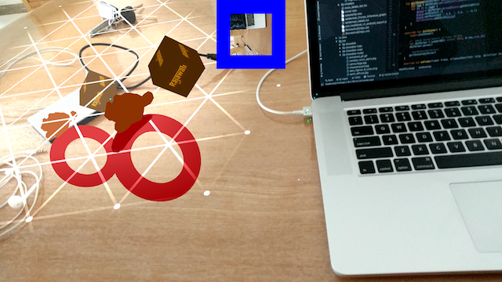
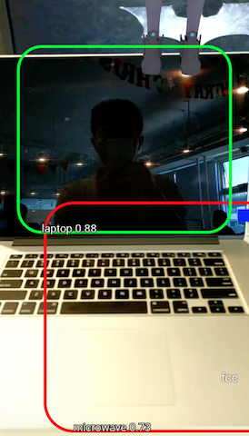
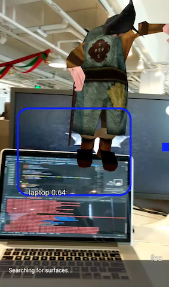
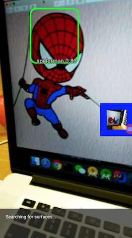

# tensorflow-rajawali

## What is it
The project integrates ARCore and TensorFlow objection detection for [Rajawali](https://github.com/Rajawali/Rajawali),
which is a 3D render engine but doesn't include any AR or AI features.

## Demo
1. Put static object at ARCore plane

2. Object detection

3. Object detection with 3D animation

4. Object detection for your custom training model - Spider Man

